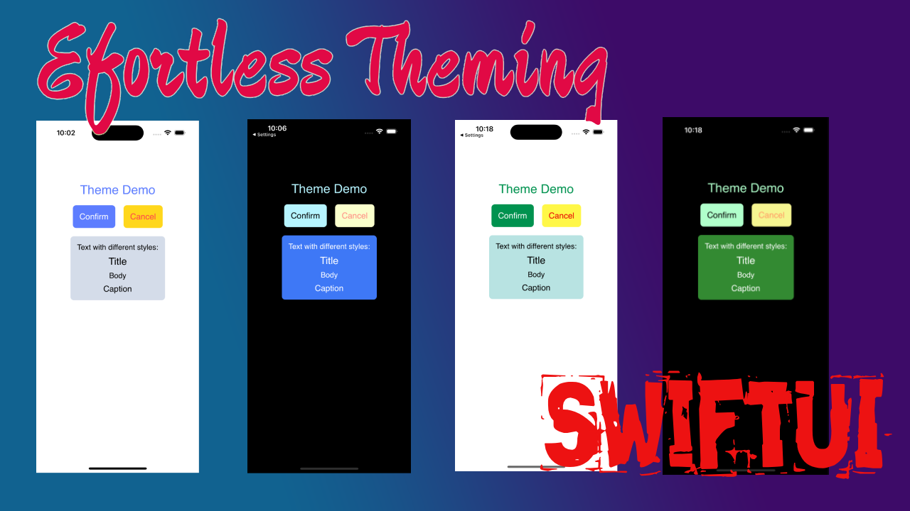

# ThemeManagerDemo
Now, managing styles & themes of iOS app is easiest than ever with SwiftUI. This article focuses on the best practices for managing themes and styles in iOS apps. We'll delve into effective methods of using fonts, colors, and styles that seamlessly support multiple themes. By implementing these practices, your app becomes adaptable for app whitelisting, rebranding, and reskinning purposes. Discover how these strategies empower your app's versatility, ensuring a visually cohesive and customisable experience for users.

## Full Medium Article
There is a medium article which has explained steip by step implementation of this project.
 
[Click here to read the full article](https://medium.com/@katramesh91/swift-fast-easy-api-mocking-simplifying-unit-testing-and-service-mocking-using-urlprotocol-ef7d1328fc63)

  
